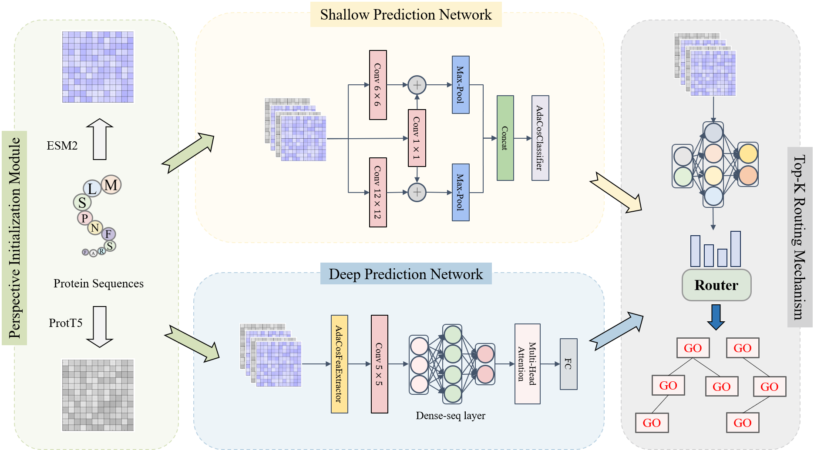

<h1 align="center">
JMARGO: Joint Multi-Perspective Representation with Multi-Branch Adaptive Routing for Protein Function Annotation
</h1>

<p align="center">


</p>
<p align="center">
This repository contains scripts used to build and train the JMARGO model, together with scripts for evaluating model performance.
</p>

 <br>
<p align="center">
Overview of the JMARGO framework for protein function annotation. (a) Perspective Initialization Module extracts ProtT5 and ESM2 per-residue embeddings. (b) Preliminary Prediction Module instantiates Shallow Prediction Networks (SPN) and Deep Prediction Networks (DPN) for each perspective. (c) Top-K Routing Mechanism performs input-conditioned selection and weighting of prediction-branch outputs.
</p>

---

## Datasets

This repository uses two benchmark datasets for training and evaluation of JMARGO. The dataset snapshots and train/validation/test splits are consistent with the protocols used in the cited publications below.

- Zhou, N.; Jiang, Y.; Bergquist, T. R.; et al. *The CAFA challenge reports improved protein function prediction and new functional annotations for hundreds of genes through experimental screens.* Genome Biol., 2019. https://doi.org/10.1186/s13059-019-1835-8  
- The UniProt Consortium; Bateman, A.; Martin, M.-J.; et al. *UniProt: The Universal Protein Knowledgebase in 2023.* Nucleic Acids Res., 2023. https://doi.org/10.1093/nar/gkac1052

### CAFA3 Dataset

* **Contents used in this work**  
  * Training set: **66,841** proteins  
  * Official CAFA3 test set: **3,328** proteins  
  * GO coverage (snapshot used in manuscript):  
    * MFO: **667** terms  
    * BPO: **3,992** terms  
    * CCO: **551** terms

* **Repo path:** `./data/cafa3`

* **Notes:** dataset snapshot and splitting follow CAFA3 protocol and related works (e.g., DeepGO / DeepGOPlus / MMSMAPlus / DeepSS2GO).

### Human Dataset (SwissProt)

* **Contents used in this work**  
  * Human SwissProt sequences: **18,673** proteins  
  * GO annotations snapshot used in manuscript: **February 2021**  
    * MFO: **475** terms  
    * BPO: **2,933** terms  
    * CCO: **446** terms

* **Repo path:** `./data/homo`

* **Notes:** dataset snapshot and splitting follow the UniProt / MMSMAPlus protocol.

### Dataset summary

| Dataset | Train | Test | MFO | BPO | CCO | Repo path |
|---|---:|---:|---:|---:|---:|---|
| CAFA3 | 66,841 | 3,328 | 667 | 3,992 | 551 | `./data/cafa3` |
| Human (SwissProt) | 18,673 |  | 475 | 2,933 | 446 | `./data/homo` |

---

## Environment Setup

### Create conda environment

```bash
conda create -n jmargo python=3.8 -y
conda activate jmargo
```

Install Python dependencies:

```bash
pip install numpy pandas scikit-learn biopython tqdm
pip install transformers==4.5.1
pip install torch==1.8.0 torchvision==0.9.0
```

**Note:** Choose a PyTorch wheel matching your CUDA version if using GPU.

### Install DIAMOND

Install DIAMOND and ensure it is on your `PATH`: https://github.com/bbuchfink/diamond

Verify:

```bash
diamond --version
```

------

## Usage

### Step 1: Feature extraction

Download pretrained models for **ESM2** and **ProtT5**, then extract features using the scripts in `feature_extract`:

```bash
python feature_extract/esm2/extract_esm.py
python feature_extract/pt5/extract_pt5.py.py
```


### Step 2: Training and prediction

Configure `config.py` with data, feature, and output paths and hyperparameters.

Train:

```bash
python main.py
```

Evaluate / predict (In config.py set the parameter phase = 'test'):

```bash
python main.py
```

**Outputs**

- `results/prediction.pkl` — model predictions
- `results/JMARGO.txt` — evaluation metrics

------

## References

- Zhou, N.; Jiang, Y.; Bergquist, T. R.; et al. The CAFA challenge reports improved protein function prediction and new functional annotations for hundreds of genes through experimental screens. *Genome Biol.* 2019;20:244. https://doi.org/10.1186/s13059-019-1835-8
- The UniProt Consortium; Bateman, A.; Martin, M.-J.; et al. UniProt: The Universal Protein Knowledgebase in 2023. *Nucleic Acids Res.* 2023;51(D1):D523–D531. https://doi.org/10.1093/nar/gkac1052
- Kulmanov, M.; Khan, M. A.; Hoehndorf, R. DeepGO: Predicting Protein Functions from Sequence and Interactions Using a Deep Ontology-Aware Classifier. *Bioinformatics.* 2018;34:660–668.
- Kulmanov, M.; Hoehndorf, R. DeepGOPlus: Improved Protein Function Prediction from Sequence. *Bioinformatics.* 2020;36:422–429.
- Wang, Z.; Deng, Z.; Zhang, W.; et al. MMSMAPlus: A Multi-View Multi-Scale Multi-Attention Embedding Model for Protein Function Prediction. *Brief. Bioinform.* 2023;24:bbad201.
- Song, F. V.; Su, J.; Huang, S.; et al. DeepSS2GO: Protein Function Prediction from Secondary Structure. Brief. Bioinform. 2024;25:bbae196. https://doi.org/10.1093/bib/bbae196
